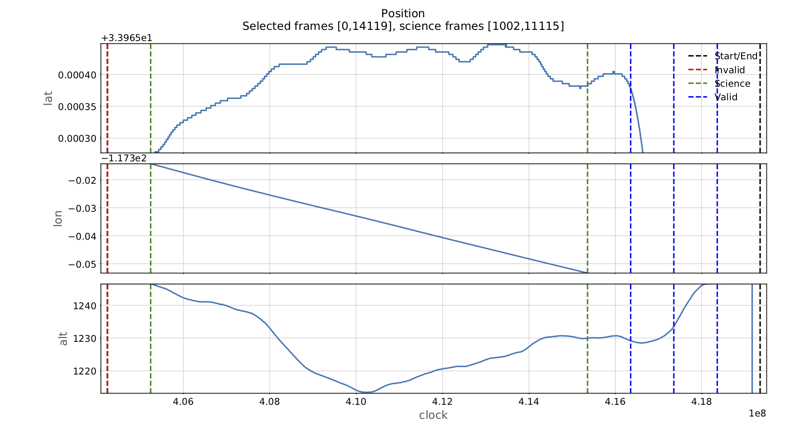
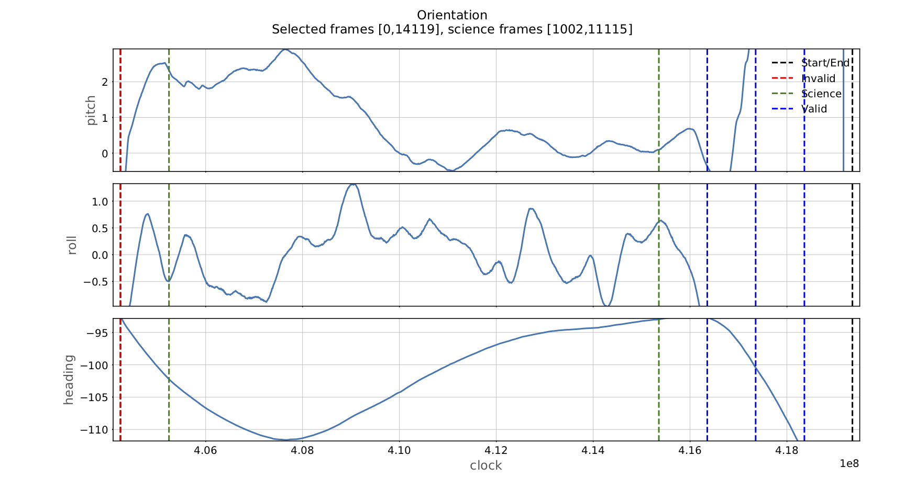
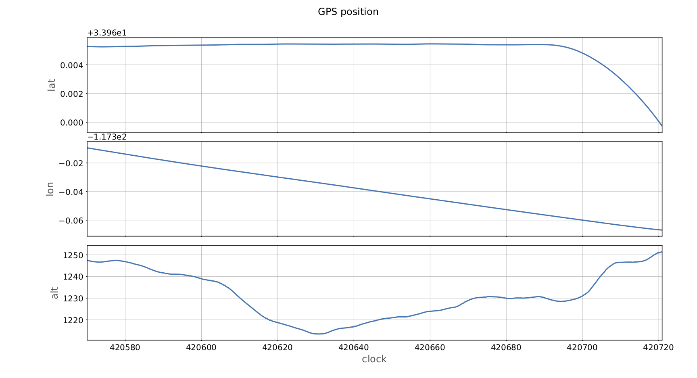
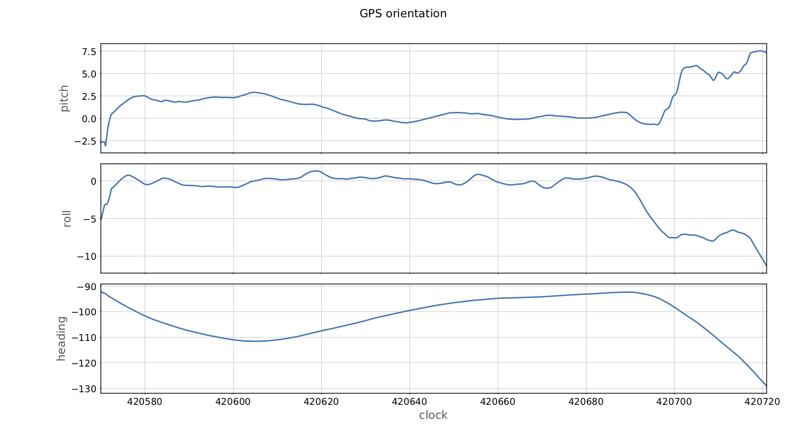
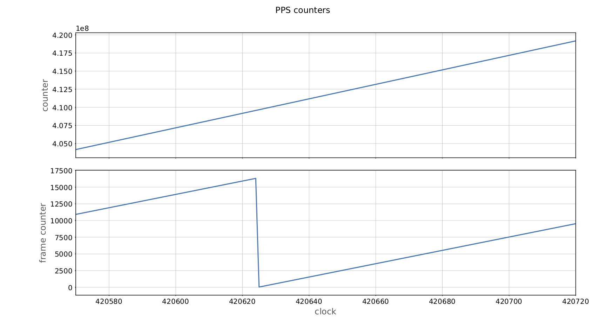

## ortho_nav navigation data diagnostic utility

### Usage

```
usage: ortho_nav.py [-h] [-f FRAME FRAME] [--plot_tables] 
                    [--plot_frames] [-v] rawf

positional arguments:
  rawf                  Path to raw image file

optional arguments:
  -h, --help            show this help message and exit
  -f FRAME FRAME, --frame_range FRAME FRAME
                        Frame range (default=(0,-1))
  --plot_tables         Plot PPS/GPS table coordinates and clock ticks
  --plot_frames         Plot frame coordinates and clock ticks
  -v, --verbose         Verbose output ([0,1,2])
```

### Example Input Output

#### Input 

```
bbue@valis$ p ortho_nav.py --plot_frames --plot_tables --verbose \
  --frame_range 0 -1 /lustre/ang/y14/raw/ang20140612t204858_raw  
```

Arguments:

--frame\_range 0 -1: process the first (frame=0) through the last (frame=-1) frame index in the image

--verbose: print info about each frame in frame_range to stdout

--plot\_frames: generate figures showing the position/orientation of each frame in frame_range

--plot\_tabels: generate figures showing the GPS position/orientation and PPS counters

#### Output

```
Loading PPS/GPS tables for ang20140612t204858_raw, platform AVIRIS-NG

Collecting frames 0 through 15112

frame[0] type: OBC_SCIENCE
clock,count: [404239982      5339]
lat,lon,alt: [  33.965261 -117.309806 1247.163759]
pitch,roll,heading: [ -2.656471  -3.478841 -92.740419]

frame[1] type: OBC_SCIENCE
clock,count: [404240982      5340]
lat,lon,alt: [  33.965261 -117.309811 1247.15977 ]
pitch,roll,heading: [ -2.655238  -3.457976 -92.742946]

frame[2] type: OBC_DARK1 
clock,count: [404241982      5341]
lat,lon,alt: [  33.965261 -117.309815 1247.155781]
pitch,roll,heading: [ -2.654004  -3.437112 -92.745473]

...

frame[1002] type: OBC_DARK1
clock,count: [405242022      6341]
lat,lon,alt: [  33.965274 -117.31421  1246.573042]
pitch,roll,heading: [   2.316727   -0.497833 -102.226867]

frame[1003] type: OBC_SCIENCE
clock,count: [405243022      6342]
lat,lon,alt: [  33.965275 -117.314214 1246.568789]
pitch,roll,heading: [   2.313981   -0.496971 -102.233371]

...

frame[11115] type: OBC_SCIENCE
clock,count: [415355422        70]
lat,lon,alt: [  33.965383 -117.353327 1229.918866]
pitch,roll,heading: [  0.090288   0.617745 -92.97387 ]

frame[11116] type: OBC_DARK2
clock,count: [415356423        71]
lat,lon,alt: [  33.965383 -117.353331 1229.919976]
pitch,roll,heading: [  0.09077    0.618098 -92.972158]

...

done, collected 15112 frames

GPS table
total lines:     1510
latitude range:  (33.95973365753889, 33.96544776856899)
longitude range: (-117.36688887700438, -117.30948558077216)
altitude range:  (1213.448501586914, 1251.3750915527344)
start location:  [  33.965261 -117.309486 1247.485794]
end location:    [  33.959734 -117.366889 1251.375092]
start tick:      420570.002917
end tick:        420720.901667
tick range:      (420570.00291666656, 420720.9016666666)

PPS table
total lines:     151
start counter:   404168429.0
end counter:     419168382.0
counter range:   (404168429.0, 419168382.0)
start fc:        10920.0
end fc:          9535.0
fc range:        (36.0, 16320.0)
start tick:      420570.0
end tick:        420720.0
tick range:      (420569.9999999999, 420719.9999999999)

Plotting gps_table locations (1510 entries)
Plotting pps_table counters (151 entries)
Plotting frames (15112 entries)
```
For the full stdout output see: [ang20140612t204858\_raw\_stdout.txt](ang20140612t204858_raw_stdout.txt)

#### Frame position + orientation
The figures below show the position (latitude, longitude, altitude) and orientiation (pitch,roll,heading) of each frame extracted from the ang20140612t204858\_raw image. 

Dashed vertical lines indicate the locations of state transitions between frame types. Since we only orthorectify science frames, pyortho needs to identify when the frames transition from the initial calibration region (OBC\_DARK1) to the region containing science frames (OBC\_SCIENCE) and back to the second dark region (OBC\_DARK2) flightline will contain the following transitions:


* <b><font color="black">Black</font></b> lines show the first and last clock values in the file
* <b><font color="green">Green</font></b> lines show the region of values containing the science frames after the initial calibration region.
* <b><font color="blue">Blue</font></b> lines show additional state transitions that are not used by the orthoprocessing code
* <b><font color="red">Red</font></b> lines indicate invalid (e.g., OBC_SCIENCE -> OBC_DARK1) transitions. 

Invalid transitions typically occur when the frame buffer dumps frames from a previous acquisition at the beginning of a new raw image. These should be skipped via

```orthorectify.py -s/--skiplines frame_index ...``` 

where the clock tick at frame_index is larger than the clock tick where the red bar occurs.





### GPS table position + orientation





### PPS table counter + frame counter

